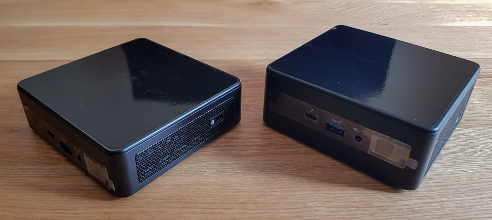

The retroNUC project comes from a stupidly ambitious idea:

### "How many playable video games can you fit onto a single device?"

I'd been trying for six months or so to set up an emulation project using a Raspberry Pi 4B and RetroPie, and it was working _okay_, but I kept running across lots of minor issues. In addition, the device wasn't struggling to run some later 3D-based consoles like the GameCube, which is where a lot of my nostagia lies.

Instead of upgrading to a slightly more expensive 64-bit single-board computer like the ODROID, I decided to throw common sense out the window when I saw the release of Intel's new 11th Generation NUC devices... 

  

Aren't they cute? And with enough horsepower to run anything I throw at them at 4K, I think it's possible to make the _perfect_ emulation box. Screw the cost. And I might as well share my journey with everyone else.

## Project Goals
* Curate a library with full playable collections for all controller-based home consoles
  * Everything configured as seamlessly as possible with a single device - Pick up a controller, select a game, and start playing straight away
  * Use the 1G1R ('One game, one ROM') princible to cut collections down from archive-quality complete sets to reasonable browsable/playable collections
  * Potential expansion into arcade and home computer collections, but I don't want to attach anything more than a controller

* Achieve the best _realistic_ experience available on modern hardware
  * A focus on accurate emulators and cores, outputting at the original resolution of the console with no additional enchancements (anti-aliasing, internal resolution boosts, etc.)
  * Use RetroArch's overlay/shader systems where appropiate to emulate the look of CRT/LCD screens at a 4K resolution, without needing to invest in expensive older technology

* Present games in a user-friendly way that preserves the history
  * A custom artbook-style frontend theme, showing off gameplay images/videos alongside production details
  * An accurate database of information such as developers, publishers and release dates, compiled from various sources

* Contribute back to video game emulation and preservation resources
  * Capture/gather screenshots and video clips where existing resources don't meet my own quality standards, and upload these to catalog sites
  * Use my coding and development experience to test and report issues, as well as submit bug fixes or feature improvements to open-source software

* Develop my own skills
  * Familiarity with Linux-based systems (which I've never used before)
  * Web development, markdown, and getting back into blogging
  * Image and video editing skills, and maybe even some livestreaming